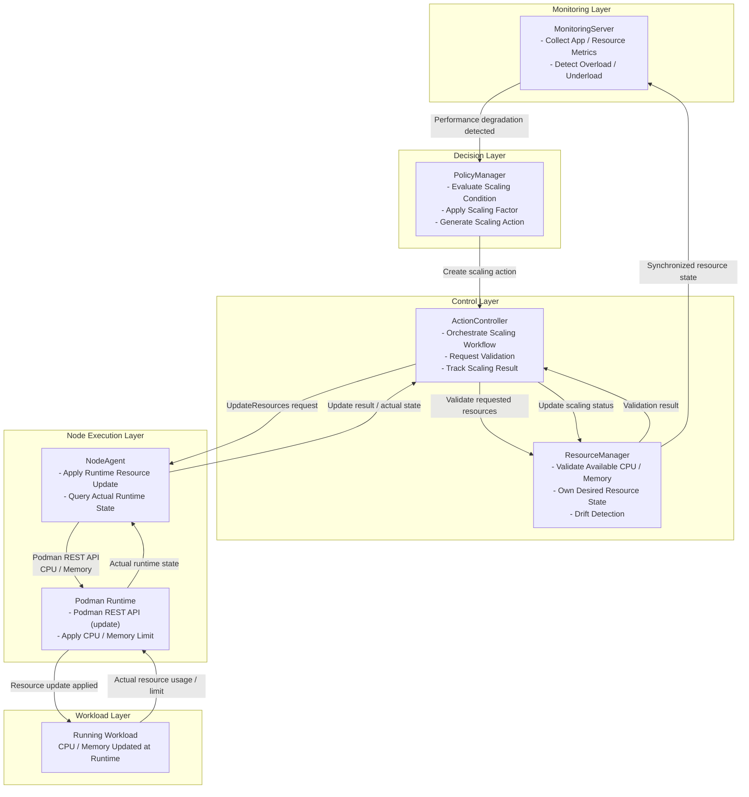
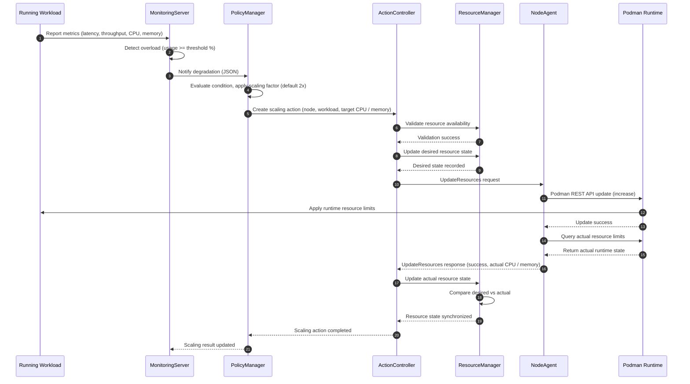
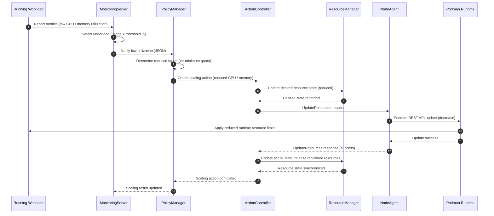
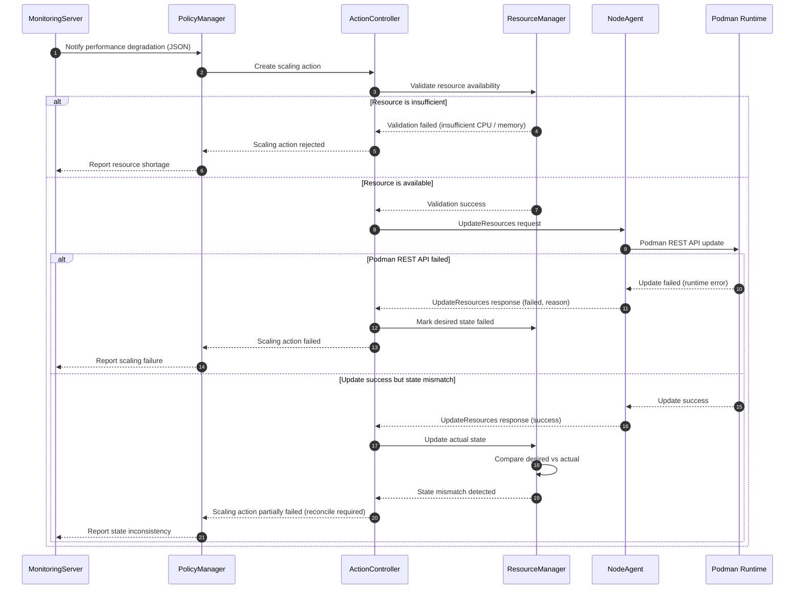

<!--
* SPDX-FileCopyrightText: Copyright 2026 LG Electronics Inc.
* SPDX-License-Identifier: Apache-2.0
-->
# Dynamic Resource Scaling System Design Document

**Document No.**: Pullpiri-RESOURCESCALING-HLD-2026-001  
**Version**: 1.0  
**Date**: 2026-07-29  
**Author**: Pullpiri Team  
**Classification**: HLD (High-Level Design)

## 1. Project Overview

**Project Name**: Dynamic Resource Scaling for Performance-Based Reconcile  
**Purpose/Background**: Provide the ability to change the CPU and memory resources of a running workload at runtime, based on performance degradation detected by monitoring.  
**Key Features**: Overload detection, scaling decision, resource validation, runtime resource update via Podman REST API, desired/actual state synchronization  
**Target Users**: Embedded / vehicle service developers and operators

### 1.1 Purpose

The Dynamic Resource Scaling feature enables Pullpiri to adjust the CPU and memory limits of a running workload without restarting it.

1. Detect application performance degradation (overload) based on runtime metrics
2. Decide the required resource adjustment and apply it at runtime
3. Keep Pullpiri-managed resource state consistent with the actual container runtime state
4. Recover from update failures and state drift through a reconciliation model

### 1.2 Key Features

1. **Overload / Underload Detection**
   - MonitoringServer compares workload metrics with the configured quota / limitation
   - Detects overload when usage reaches the threshold percentage
   - Detects underload when usage drops below the threshold percentage

2. **Scaling Decision**
   - PolicyManager evaluates the scaling condition
   - Applies a scaling factor (default 2x, configurable)
   - Generates a scaling action (node, workload, target CPU / memory)

3. **Resource Validation and State Management**
   - ResourceManager validates available CPU / memory before applying the update
   - Owns the desired resource state and detects drift against the actual state

4. **Runtime Resource Update**
   - NodeAgent applies the update at runtime through the Podman REST API
   - Reports the actual runtime state back for synchronization

### 1.3 Scope

- Runtime CPU and memory update for a single workload on a single node
- Metric-driven scale-up and scale-down
- Desired/actual resource state synchronization and reconcile
- Podman-based container runtime

## 2. Technologies and Environment

**Main Languages/Frameworks**: Rust  
**Other Libraries/Tools**: gRPC, Podman REST API (libpod), etcd  
**Deployment/Operation Environment**: Embedded Linux, Podman container runtime

## 3. Architecture

Dynamic Resource Scaling follows a layered design in which policy decision, execution, and state management are separated.

### 3.1 System Structure



### 3.2 Core Components

| Component | Role | Interaction |
|-----------|------|-------------|
| MonitoringServer | Collect metrics, detect overload/underload | PolicyManager, NodeAgent |
| PolicyManager | Evaluate scaling condition, apply scaling factor, generate action | MonitoringServer, ActionController |
| ActionController | Orchestrate scaling workflow, track result | PolicyManager, ResourceManager, NodeAgent |
| ResourceManager | Validate resources, own desired state, drift detection | ActionController, NodeAgent |
| NodeAgent | Apply runtime resource update, query actual state | ActionController, Podman Runtime |
| Podman Runtime | Apply actual container resource limits | NodeAgent |

> **Note:** ResourceManager is introduced as a new component for this feature. Its detailed responsibility boundary requires further discussion (2026-07-13 design review).

### 3.3 Technology Stack

| Layer | Technology | Description |
|-------|------------|-------------|
| Core Service | Rust | Core service implementation language |
| Communication Protocol | gRPC | Inter-component communication |
| Container Runtime | Podman | Runtime resource update via Podman REST API (libpod) |
| State Storage | etcd | Desired / actual resource state persistence |

## 4. Requirements

### 4.1 Functional Requirements

1. Detect workload overload/underload by comparing metrics against a configurable threshold percentage.
2. Generate a scaling action with a configurable scaling factor (default 2x).
3. Validate available node resources before applying a scale-up.
4. Update the CPU and memory limits of a running container through the Podman REST API.
5. Query and report the actual runtime resource state after an update.
6. Compare desired and actual state, detect drift, and trigger reconciliation.

### 4.2 Non-Functional Requirements

1. Resource update must not require a workload restart for supported resource types.
2. Desired/actual state must converge through periodic and event-driven synchronization.
3. Scale-up must be a best-effort operation bounded by available resources.
4. The system must remain consistent after NodeAgent or component restart.

## 5. Key Feature Details

### 5.1 Overload / Underload Detection

MonitoringServer compares the workload metrics (latency, throughput, CPU, memory) with the configured quota / limitation and forwards the result to PolicyManager as JSON. Overload is detected when usage reaches the threshold percentage; underload when it drops below it.

### 5.2 Scaling Decision

PolicyManager evaluates whether scaling is required and applies the scaling factor (default 2x, configurable) to compute the target CPU / memory. It creates a scaling action that specifies the target node, workload, and resource amount.

### 5.3 Resource Validation

ResourceManager computes the available resources (`Total - Allocated - Reserved`) and decides whether the requested amount can be allocated. Scale-down does not require validation because it never exceeds capacity.

### 5.4 Runtime Resource Update

NodeAgent applies the update at runtime through the Podman REST API
(`POST /containers/{id}/update`) and then queries the actual runtime state for synchronization.

### 5.5 Sequence Scenarios

#### Scenario 1. Scale-Up (Overload)



#### Scenario 2. Scale-Down (Underload)



#### Scenario 3. Failure Case



## 6. Data Model

### 6.1 State Ownership

| State | Owner | Description |
|-------|-------|-------------|
| Desired Resource State | ResourceManager | Target resource state managed by Pullpiri |
| Actual Resource State | NodeAgent | Resource state actually applied in the container runtime |

```yaml
# Desired Resource State
workload-a:
  cpu_limit: 4
  memory_limit: 2048Mi
```

### 6.2 Synchronization State

```protobuf
enum ResourceSyncState {
  UNKNOWN        = 0;
  PENDING        = 1;
  APPLYING       = 2;
  SYNCHRONIZED   = 3;
  DRIFT_DETECTED = 4;
  FAILED         = 5;
}
```

State transitions: `PENDING → APPLYING → SYNCHRONIZED`, with `DRIFT_DETECTED → RECONCILE → SYNCHRONIZED` and `FAILED` as failure branch.

## 7. Interfaces

### 7.1 ActionController — RequestResourceScaling

Triggers the scaling workflow. Specifies which node, which workload, and how much to adjust.

```protobuf
rpc RequestResourceScaling (ScalingActionRequest) returns (ScalingActionResponse);

message ScalingActionRequest {
  string node_id             = 1;
  string workload_id         = 2;
  uint32 target_cpu_limit    = 3;
  uint64 target_memory_limit = 4;
  ScalingType scaling_type   = 5;   // SCALE_UP / SCALE_DOWN
}
```

### 7.2 NodeAgent — UpdateResources / GetResourceStatus

Unified API used for both CPU and memory (and both scale-up and scale-down). NodeAgent calls the Podman REST API `POST /containers/{id}/update` to apply the change at runtime.

```protobuf
rpc UpdateResources  (UpdateResourcesRequest)  returns (UpdateResourcesResponse);
rpc GetResourceStatus(GetResourceStatusRequest) returns (GetResourceStatusResponse);

message UpdateResourcesRequest {
  string workload_id           = 1;
  optional uint32 cpu_limit    = 2;
  optional uint64 memory_limit = 3;   // MiB
}
```

### 7.3 ResourceManager — ValidateResourceUpdate

```protobuf
rpc ValidateResourceUpdate (ValidateResourceUpdateRequest) returns (ValidateResourceUpdateResponse);

message ValidateResourceUpdateRequest {
  string workload_id      = 1;
  uint32 requested_cpu    = 2;
  uint64 requested_memory = 3;
}
```

### 7.4 API Ownership

| API | Owner |
|-----|-------|
| RequestResourceScaling | ActionController |
| UpdateResources | NodeAgent |
| GetResourceStatus | NodeAgent |
| ValidateResourceUpdate | ResourceManager |

## 8. Performance & Scalability

- Runtime resource update avoids workload restart, minimizing service disruption.
- The unified `UpdateResources` API supports CPU-only, memory-only, or combined updates and is reusable for future resource types (network, storage).

## 9. Security

- Resource updates are only issued through internal gRPC interfaces between trusted Pullpiri components.
- The Podman REST API is accessed locally by NodeAgent on the target node.

## 10. Fault Handling & Recovery

Dynamic Resource Scaling adopts a Kubernetes-style desired-state reconciliation model.

- **Drift detection**: ResourceManager compares desired and actual state and flags `DRIFT_DETECTED`.
- **Reconciliation**: On drift, the desired state is re-applied through `UpdateResources` retry.
- **Startup reconciliation**: On restart, the desired state is loaded, the runtime state is queried, and both are compared to rebuild the actual state.
- **Failure states**: NodeAgent unavailable, Podman update failure, or runtime query failure transition the sync state to `FAILED`.

## 11. Monitoring & Logging

- MonitoringServer provides the metrics that trigger scaling and receives the final scaling result.
- Each scaling action transitions through observable states (`PENDING`, `RUNNING`, `SUCCESS`, `FAILED`).

## 12. Deployment & Operations

- The scaling factor and threshold percentage are provided through configuration and are adjustable per deployment.
- Periodic synchronization interval (e.g., 30/60/300 seconds) is determined by operational policy.

## 13. Constraints & Limitations

- **Runtime capability dependency**: Only resource types supported by the runtime (CPU limit/shares/affinity, memory limit) can be changed dynamically; HugePages, NUMA binding, and kernel parameters cannot.
- **Best-effort allocation**: Scale-up is bounded by available node resources and may be rejected.
- **No guaranteed performance improvement**: Increasing resources does not resolve degradation caused by external latency, network, or application logic.
- **State divergence and synchronization delay**: Desired and actual state may differ temporarily.
- **NodeAgent dependency**: NodeAgent is the single execution point for runtime updates.
- **Scale-down risk**: Aggressive scale-down may cause OOM or performance degradation and needs additional validation.
- **No automatic rollback / multi-node consistency**: Out of scope for this design.

## 14. Future Improvements

- Resource reservation / allocation locking to prevent overcommit under concurrent requests.
- Automatic rollback on partial update.
- Cluster-level resource management and cross-node migration.
- Extension to network and storage resource scaling via the same `UpdateResources` API.

## 15. References

- Issue: [Design] Dynamic Resource Scaling for Performance-Based Reconcile (eclipse-pullpiri/pullpiri#514)
