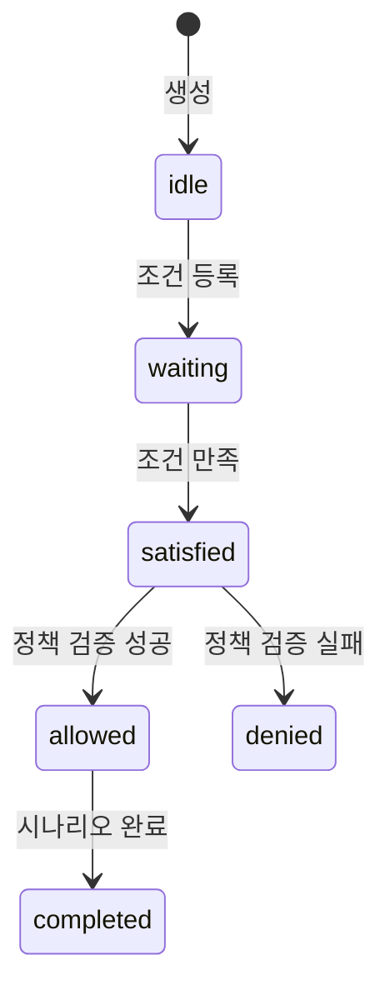

## 4.1 Scenario 정의 및 상태 전이 다이어그램
### 4.1.1 상태 정의
| 상태 | 설명 |
|------|------|
| idle | 시나리오가 초기화된 상태 (아직 활성화되지 않음) |
| waiting | 조건이 등록된 상태 |
| satisfied | 조건이 만족된 상태 |
| allowed | 정책에 의해 실행이 허용된 상태 |
| denied | 정책에 의해 실행이 거부된 상태 |
| completed | 시나리오 실행이 완료된 상태 |

### 4.1.2 상태 전이 다이어그램

## 2. package 상태 정의 및 상태 전이 조건 요약표
| 상태      | 설명 | 조건 |
|-----------|------|---------------------------------------------------|
| idle      | 맨 처음 package의 상태 | 생성 시 기본 상태 |
| paused    | 모든 model이 paused 상태일 때 | 모든 model이 paused 상태 |
| exited    | 모든 model이 exited 상태일 때 | 모든 model이 exited 상태 |
| degraded  | 일부 model이 dead 상태일 때 | 일부(1개 이상) model이 dead 상태, 단 모든 model이 dead가 아닐 때 |
| error     | 모든 model이 dead 상태일 때 | 모든 model이 dead 상태 |
| running   | 위 조건을 모두 만족하지 않을 때(기본 상태) | 위 조건을 모두 만족하지 않을 때(기본 상태) |

## 3. model 상태 정의 및 상태 전이 조건 요약표
| 상태      | 설명 | 조건 |
|-----------|------|---------------------------------------------------|
| Created   | model의 최초 상태 | 생성 시 기본 상태 |
| Paused    | 모든 container가 paused 상태일 때 | 모든 container가 paused 상태 |
| Exited    | 모든 container가 exited 상태일 때 | 모든 container가 exited 상태 |
| Dead      | 하나 이상의 container가 dead 상태이거나, model 정보 조회 실패 | 하나 이상의 container가 dead 상태이거나, model 정보 조회 실패 |
| Running   | 위 조건을 모두 만족하지 않을 때(기본 상태) | 위 조건을 모두 만족하지 않을 때(기본 상태) |

## 4. container 상태 정의 및 상태 전이 조건 요약표
| 상태     | 설명                                                                 | 조건                                                         |
|----------|----------------------------------------------------------------------|--------------------------------------------------------------|
| Created  | 컨테이너가 생성되었지만 아직 실행되지 않은 상태 | 컨테이너가 생성되지 않았거나 모두 삭제된 경우                |
| Running  | 컨테이너가 현재 실행 중이며, 내부 프로세스가 동작 중인 상태                                 | 하나 이상의 컨테이너가 실행 중                                |
| Paused  | 컨테이너가 일시 중지된 상태. 프로세스는 메모리에 있지만 실행되지 않음        | 하나 이상의 컨테이너가 중지, 실행 중인 컨테이너는 없음        |
| Exited   | 컨테이너가 종료된 상태. 정상 또는 오류 종료 모두 포함                          | 모든 컨테이너가 종료됨                                       |
| Stopped  | exited와 유사하게, 수동으로 중지된 상태    |    |
| unknown  | 컨테이너의 상태를 확인할 수 없는 경우. 보통 시스템 오류나 메타데이터 손상 시 발생 | 상태 정보 조회 실패, 시스템 오류 등                           |
