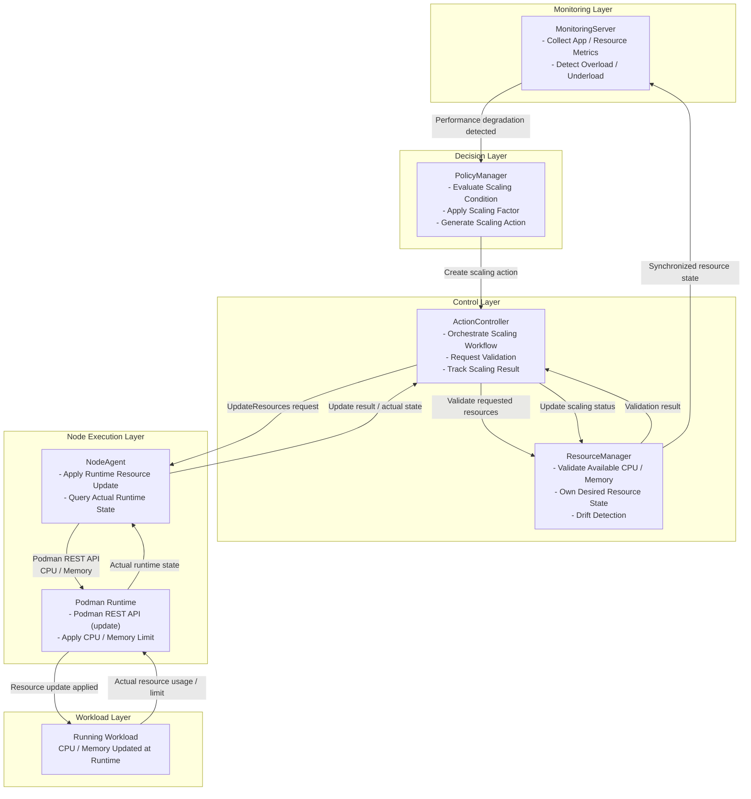
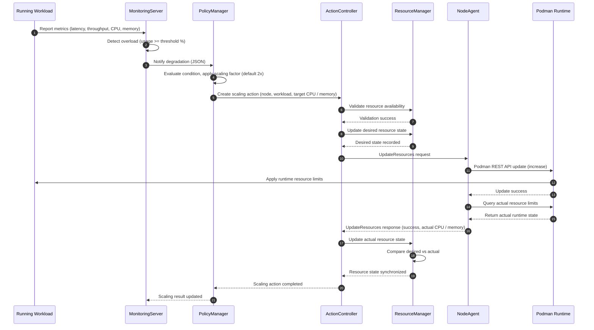
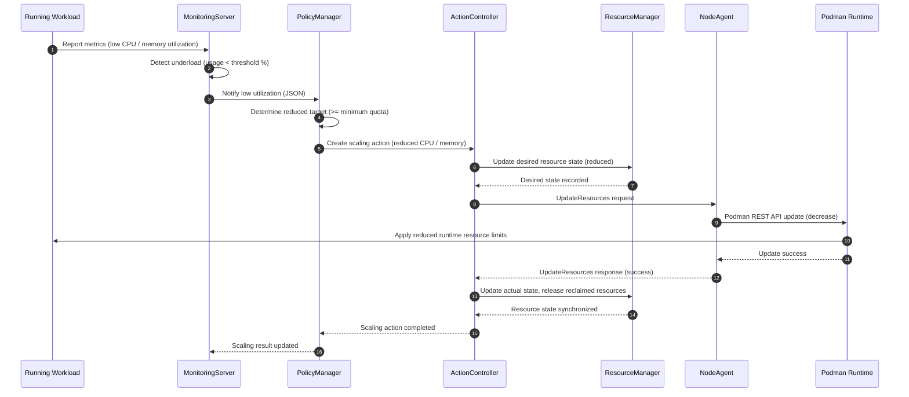
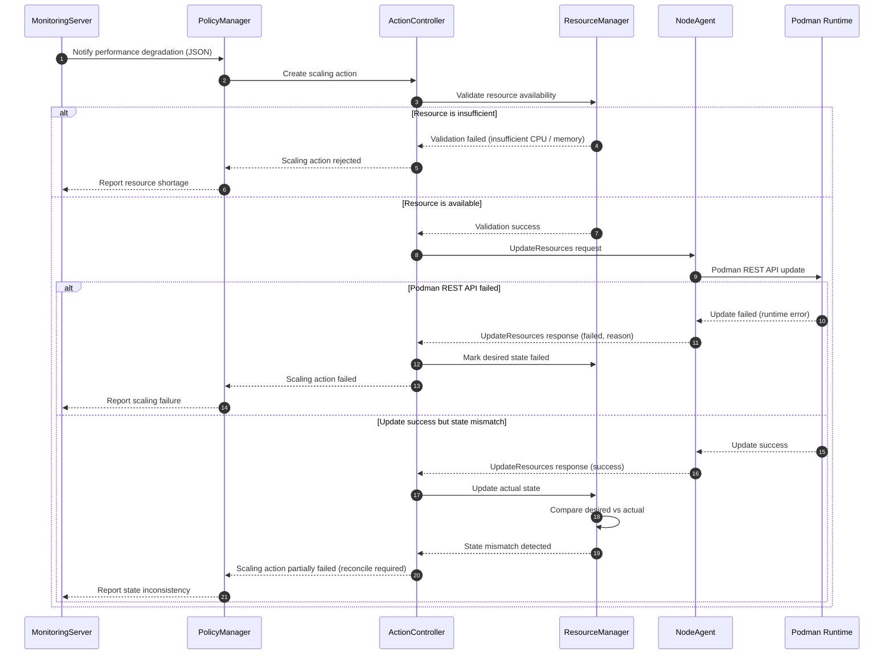

<!--
* SPDX-FileCopyrightText: Copyright 2026 LG Electronics Inc.
* SPDX-License-Identifier: Apache-2.0
-->
# Dynamic Resource Scaling 시스템 설계 문서

**Document No.**: Pullpiri-RESOURCESCALING-HLD-2026-001  
**Version**: 1.0  
**Date**: 2026-07-29  
**Author**: Pullpiri Team  
**Classification**: HLD (High-Level Design)

## 1. 프로젝트 개요

**프로젝트명**: Performance-Based Reconcile를 위한 Dynamic Resource Scaling  
**목적/배경**: Monitoring이 감지한 성능 저하를 기반으로, 실행 중인 Workload의 CPU 및 Memory Resource를 Runtime에 변경하는 기능을 제공한다.  
**주요 기능**: 과부하 감지, Scaling 판단, Resource 검증, Podman REST API를 통한 Runtime Resource 변경, Desired/Actual State 동기화  
**대상 사용자**: 임베디드 / 차량 서비스 개발자 및 운영자

### 1.1 목적

Dynamic Resource Scaling은 Workload를 재시작하지 않고 실행 중인 상태에서 CPU 및 Memory Limit을 조정할 수 있게 한다.

1. Runtime Metric을 기반으로 애플리케이션 성능 저하(과부하)를 감지한다.
2. 필요한 Resource 조정량을 판단하고 Runtime에 적용한다.
3. Pullpiri 관리 상태와 실제 Container Runtime 상태가 일관성을 유지하도록 한다.
4. Reconciliation 모델을 통해 Update 실패 및 State Drift에서 복구한다.

### 1.2 주요 기능

1. **과부하 / 저부하 감지**
   - MonitoringServer가 Workload Metric을 Quota / Limitation과 비교
   - 사용량이 기준 % 이상이면 과부하로 판단
   - 사용량이 기준 % 미만이면 저부하로 판단

2. **Scaling 판단**
   - PolicyManager가 Scaling 조건을 평가
   - Scaling Factor(기본 2배, Configuration 조정 가능)를 적용
   - Scaling Action(node, workload, 목표 CPU / memory)을 생성

3. **Resource 검증 및 State 관리**
   - ResourceManager가 적용 전 가용 CPU / Memory를 검증
   - Desired Resource State의 Owner이며 Actual State와의 Drift를 탐지

4. **Runtime Resource 변경**
   - NodeAgent가 Podman REST API를 통해 Runtime에 변경 적용
   - 실제 Runtime State를 조회하여 동기화를 위해 보고

### 1.3 범위

- 단일 노드의 단일 Workload에 대한 Runtime CPU / Memory 변경
- Metric 기반 Scale-Up 및 Scale-Down
- Desired/Actual Resource State 동기화 및 Reconcile
- Podman 기반 Container Runtime

## 2. 기술 및 환경

**주요 언어/프레임워크**: Rust  
**기타 라이브러리/도구**: gRPC, Podman REST API (libpod), etcd  
**배포/운영 환경**: 임베디드 Linux, Podman Container Runtime

## 3. 아키텍처

Dynamic Resource Scaling은 정책 판단(Decision), 실행(Execution), 상태 관리(State Management)를 분리한 계층형 구조를 따른다.

### 3.1 시스템 구조



### 3.2 핵심 컴포넌트

| Component | 역할 | 상호작용 |
|-----------|------|----------|
| MonitoringServer | Metric 수집, 과부하/저부하 감지 | PolicyManager, NodeAgent |
| PolicyManager | Scaling 조건 평가, Scaling Factor 적용, Action 생성 | MonitoringServer, ActionController |
| ActionController | Scaling Workflow 오케스트레이션, 결과 추적 | PolicyManager, ResourceManager, NodeAgent |
| ResourceManager | Resource 검증, Desired State 소유, Drift 탐지 | ActionController, NodeAgent |
| NodeAgent | Runtime Resource 변경 적용, Actual State 조회 | ActionController, Podman Runtime |
| Podman Runtime | 실제 Container Resource Limit 적용 | NodeAgent |

> **Note:** ResourceManager는 본 기능을 위해 신규 도입되는 컴포넌트이며, 세부 역할 및 책임 범위는 별도 논의가 필요하다. (2026-07-13 설계 리뷰)

### 3.3 기술 스택

| Layer | Technology | 설명 |
|-------|------------|------|
| Core Service | Rust | 핵심 서비스 구현 언어 |
| Communication Protocol | gRPC | 컴포넌트 간 통신 |
| Container Runtime | Podman | Podman REST API(libpod)를 통한 Runtime Resource 변경 |
| State Storage | etcd | Desired / Actual Resource State 저장 |

## 4. 요구사항

### 4.1 기능 요구사항

1. Metric을 기준 % 임계값과 비교하여 Workload 과부하/저부하를 감지한다.
2. 조정 가능한 Scaling Factor(기본 2배)로 Scaling Action을 생성한다.
3. Scale-Up 적용 전 노드 가용 Resource를 검증한다.
4. Podman REST API를 통해 실행 중인 Container의 CPU / Memory Limit을 변경한다.
5. Update 이후 실제 Runtime Resource State를 조회하고 보고한다.
6. Desired와 Actual State를 비교하여 Drift를 탐지하고 Reconciliation을 트리거한다.

### 4.2 비기능 요구사항

1. 지원 가능한 Resource 유형은 Workload 재시작 없이 변경되어야 한다.
2. 주기적/이벤트 기반 동기화를 통해 Desired/Actual State가 수렴해야 한다.
3. Scale-Up은 가용 Resource 범위 내에서 수행되는 Best-Effort Operation이다.
4. NodeAgent 또는 컴포넌트 재시작 이후에도 상태 정합성을 유지해야 한다.

## 5. 주요 기능 상세

### 5.1 과부하 / 저부하 감지

MonitoringServer는 Workload Metric(latency, throughput, CPU, memory)을 Quota / Limitation과 비교하여 결과를 JSON 형태로 PolicyManager에 전달한다. 사용량이 기준 % 이상이면 과부하, 미만이면 저부하로 판단한다.

### 5.2 Scaling 판단

PolicyManager는 Scaling 필요 여부를 평가하고 Scaling Factor(기본 2배, Configuration 조정 가능)를 적용하여 목표 CPU / Memory를 산출한다. 대상 노드, Workload, Resource 조정량을 지정한 Scaling Action을 생성한다.

### 5.3 Resource 검증

ResourceManager는 가용 Resource(`Total - Allocated - Reserved`)를 계산하여 요청량 할당 가능 여부를 판단한다. Scale-Down은 가용량을 초과하지 않으므로 검증이 필요하지 않다.

### 5.4 Runtime Resource 변경

NodeAgent는 Podman REST API(`POST /containers/{id}/update`)를 통해 Runtime에 변경을 적용한 뒤, 동기화를 위해 실제 Runtime State를 조회한다.

### 5.5 시퀀스 시나리오

#### 시나리오 1. Scale-Up (과부하)



#### 시나리오 2. Scale-Down (저부하)



#### 시나리오 3. Failure Case



## 6. 데이터 모델

### 6.1 State Ownership

| State | Owner | 설명 |
|-------|-------|------|
| Desired Resource State | ResourceManager | Pullpiri가 목표로 하는 Resource 상태 |
| Actual Resource State | NodeAgent | Container Runtime에 실제 적용된 Resource 상태 |

```yaml
# Desired Resource State
workload-a:
  cpu_limit: 4
  memory_limit: 2048Mi
```

### 6.2 동기화 상태

```protobuf
enum ResourceSyncState {
  UNKNOWN        = 0;
  PENDING        = 1;
  APPLYING       = 2;
  SYNCHRONIZED   = 3;
  DRIFT_DETECTED = 4;
  FAILED         = 5;
}
```

상태 전이: `PENDING → APPLYING → SYNCHRONIZED`, Drift 발생 시 `DRIFT_DETECTED → RECONCILE → SYNCHRONIZED`, 실패 시 `FAILED`.

## 7. 인터페이스

### 7.1 ActionController — RequestResourceScaling

Scaling Workflow를 트리거한다. 어떤 노드의 어떤 Workload를 어느 정도 조정할지 지정한다.

```protobuf
rpc RequestResourceScaling (ScalingActionRequest) returns (ScalingActionResponse);

message ScalingActionRequest {
  string node_id             = 1;
  string workload_id         = 2;
  uint32 target_cpu_limit    = 3;
  uint64 target_memory_limit = 4;
  ScalingType scaling_type   = 5;   // SCALE_UP / SCALE_DOWN
}
```

### 7.2 NodeAgent — UpdateResources / GetResourceStatus

CPU와 Memory(그리고 Scale-Up/Scale-Down)에 공통으로 사용하는 통합 API이다. NodeAgent는 Podman REST API `POST /containers/{id}/update`를 호출하여 Runtime에 변경을 적용한다.

```protobuf
rpc UpdateResources  (UpdateResourcesRequest)  returns (UpdateResourcesResponse);
rpc GetResourceStatus(GetResourceStatusRequest) returns (GetResourceStatusResponse);

message UpdateResourcesRequest {
  string workload_id           = 1;
  optional uint32 cpu_limit    = 2;
  optional uint64 memory_limit = 3;   // MiB
}
```

### 7.3 ResourceManager — ValidateResourceUpdate

```protobuf
rpc ValidateResourceUpdate (ValidateResourceUpdateRequest) returns (ValidateResourceUpdateResponse);

message ValidateResourceUpdateRequest {
  string workload_id      = 1;
  uint32 requested_cpu    = 2;
  uint64 requested_memory = 3;
}
```

### 7.4 API Ownership

| API | Owner |
|-----|-------|
| RequestResourceScaling | ActionController |
| UpdateResources | NodeAgent |
| GetResourceStatus | NodeAgent |
| ValidateResourceUpdate | ResourceManager |

## 8. 성능 및 확장성

- Runtime Resource 변경은 Workload 재시작을 피해 서비스 중단을 최소화한다.
- 통합 `UpdateResources` API는 CPU-only, Memory-only, CPU+Memory 변경을 지원하며 향후 Resource 유형(network, storage)으로 재사용 가능하다.

## 9. 보안

- Resource 변경은 신뢰된 Pullpiri 컴포넌트 간 내부 gRPC 인터페이스로만 발행된다.
- Podman REST API는 대상 노드에서 NodeAgent가 로컬로 접근한다.

## 10. 장애 처리 및 복구

Dynamic Resource Scaling은 Kubernetes 스타일의 Desired State Reconciliation 모델을 채택한다.

- **Drift 탐지**: ResourceManager가 Desired와 Actual State를 비교하여 `DRIFT_DETECTED`로 표시한다.
- **Reconciliation**: Drift 발생 시 `UpdateResources` 재시도로 Desired State를 재적용한다.
- **Startup Reconciliation**: 재시작 시 Desired State를 로드하고 Runtime State를 조회하여 비교, Actual State를 재구성한다.
- **Failure 상태**: NodeAgent 불가, Podman Update 실패, Runtime 조회 실패 시 동기화 상태를 `FAILED`로 전이한다.

## 11. 모니터링 및 로깅

- MonitoringServer는 Scaling을 트리거하는 Metric을 제공하고 최종 Scaling 결과를 수신한다.
- 각 Scaling Action은 관찰 가능한 상태(`PENDING`, `RUNNING`, `SUCCESS`, `FAILED`)를 거친다.

## 12. 배포 및 운영

- Scaling Factor와 기준 % 임계값은 Configuration으로 제공되며 배포별로 조정 가능하다.
- 주기적 동기화 주기(예: 30/60/300초)는 운영 정책에 따라 결정한다.

## 13. 제약사항 및 한계

- **Runtime Capability 의존성**: Runtime이 지원하는 Resource 유형(CPU limit/shares/affinity, Memory limit)만 동적 변경 가능하며 HugePages, NUMA Binding, Kernel Parameter는 불가하다.
- **Best-Effort 할당**: Scale-Up은 노드 가용 Resource에 의해 제한되며 거부될 수 있다.
- **성능 개선 미보장**: Resource 증가가 외부 지연, 네트워크, 애플리케이션 로직에 기인한 저하를 해결하지는 못한다.
- **State Divergence 및 동기화 지연**: Desired와 Actual State가 일시적으로 다를 수 있다.
- **NodeAgent 의존성**: NodeAgent는 Runtime Update의 Single Execution Point이다.
- **Scale-Down 위험**: 과도한 Scale-Down은 OOM이나 성능 저하를 유발할 수 있어 추가 검증이 필요하다.
- **자동 Rollback / Multi-Node 정합성 미포함**: 본 설계 범위 밖이다.

## 14. 향후 개선

- 동시 요청 시 Overcommit 방지를 위한 Resource Reservation / Allocation Locking.
- Partial Update 시 자동 Rollback.
- Cluster-Level Resource 관리 및 Cross-Node Migration.
- 동일한 `UpdateResources` API를 통한 Network / Storage Resource Scaling 확장.

## 15. 참고자료

- Issue: [Design] Dynamic Resource Scaling for Performance-Based Reconcile (eclipse-pullpiri/pullpiri#514)
