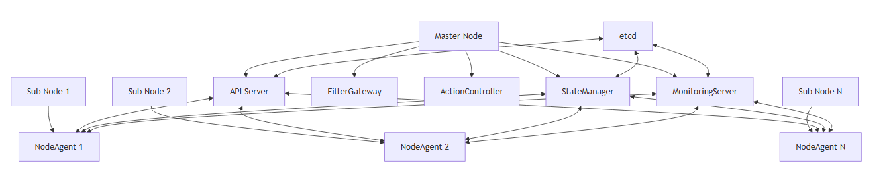

---
hide:
  - toc
---

# __PICCOLO Clustering System__

**Lightweight Container Orchestration Optimized for Embedded Environments**

| | |
|---|---|
| **Document No.** | PICCOLO-CLUSTERING-HLD-2025-001 |
| **Version** | 1.0 |
| **Date** | 2025-09-04 |
| **Author** | PICCOLO Team |
| **Classification** | HLD (High-Level Design) |

---

## __Project Overview__

-   __Project Name__

    ---

    PICCOLO Clustering System

-   __Purpose / Background__

    ---

    Development of a lightweight container orchestration cluster system optimized for
    embedded environments

-   __Main Features__

    ---

    Node management, cluster configuration, status monitoring, inter-node communication

-   __Target Users__

    ---

    Embedded system developers, administrators, operators

---

## __Purpose__

The PICCOLO Clustering System is designed to implement a distributed container
management system optimized for embedded environments.

- Provide a lightweight cluster architecture that operates efficiently in
  resource-constrained environments
- Implement seamless communication and status management between master and sub nodes
- Build a cluster system resilient to network instability
- Provide an operational model optimized for small-scale clusters

---

## __Key Features__

-   __Node Management__

    ---

    - Manage master-sub node structure
    - Node registration and authentication
    - Node status monitoring and management
    - Node system readiness verification

-   __Cluster Topology Management__

    ---

    - Configure embedded cluster topology
    - Configure hybrid cloud connections
    - Connect multiple embedded clusters
    - Configure geographically distributed clusters

-   __State Synchronization__

    ---

    - Manage state information based on etcd
    - Synchronize state information between nodes
    - Detect and notify state changes
    - Support offline mode and resynchronization upon reconnection

-   __Deployment and Operations__

    ---

    - Automatic deployment and installation of NodeAgent
    - System checks and readiness verification
    - Heartbeat-based node status monitoring
    - Fault detection and recovery

---

## __Scope__

- Small-scale embedded clusters of 2–10 nodes
- Communication management between master and sub nodes
- Integration between cloud nodes and embedded nodes
- Podman-based container monitoring and management

---

## **Architecture**

The PICCOLO Clustering System is based on a master-sub node structure and adopts a
lightweight design optimized for embedded environments.

### System Structure
{ .diagram-full }
 
### Core Components

| Component | Role | Interaction |
|---|---|---|
| **API Server** | Cluster management, node registration, policy distribution | NodeAgent, StateManager, etcd |
| **NodeAgent** | Node status monitoring, communication with master node | API Server, StateManager, MonitoringServer |
| **StateManager** | Cluster state management and synchronization | API Server, NodeAgent, etcd |
| **etcd** | Cluster state information storage | All components |
| **Installation Script** | Deploy and configure NodeAgent | Node system |
| **System Check Script** | Verify node readiness | Node system |

### Technology Stack

| Layer | Technology | Description |
|---|---|---|
| **Core Service** | https://www.rust-lang.org/ | High-performance, memory-safe core service implementation language |
| **Communication Protocol** | https://grpc.io/ | Efficient protocol for master-sub node communication |
| **State Storage** | https://etcd.io/ | Distributed key-value store for cluster state management |
| **Container Runtime** | https://podman.io/ | Daemonless lightweight container management tool |
| **Service Management** | https://systemd.io/ | Node service management and auto-start configuration |
| **Deployment Tool** | [Bash scwww.gnu.org/software/bash/ | Automation tool for node installation and configuration |

