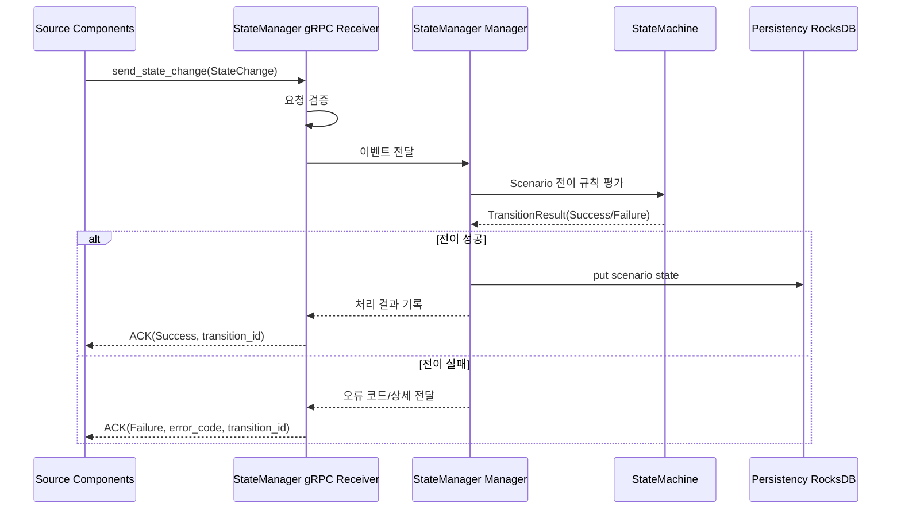
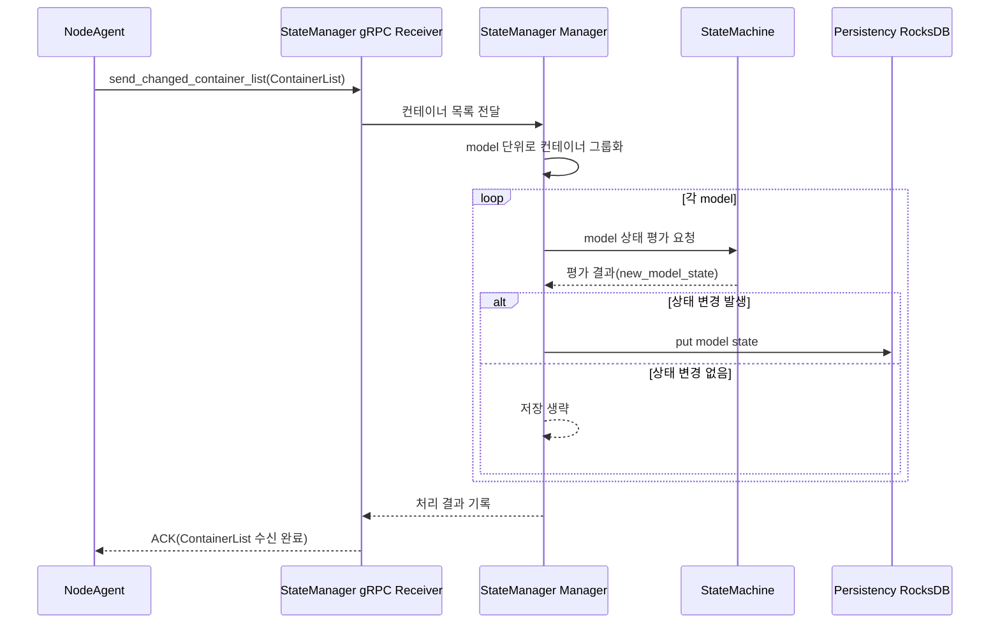
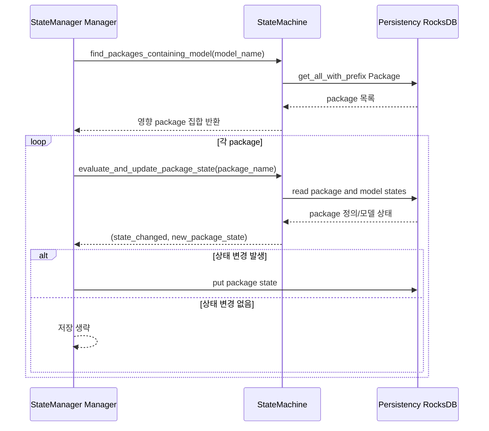
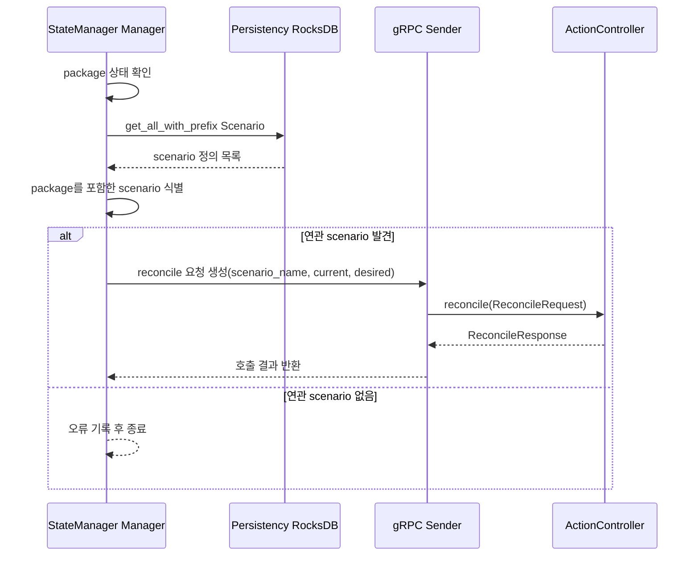
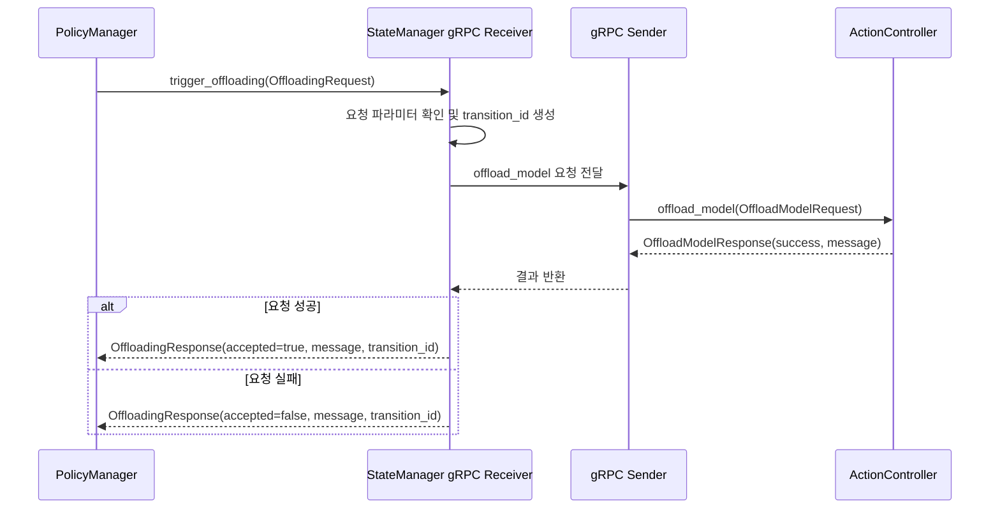
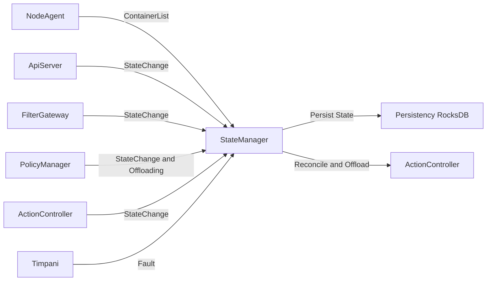

<!--
* SPDX-FileCopyrightText: Copyright 2024 LG Electronics Inc.
* SPDX-License-Identifier: Apache-2.0
-->
# StateManager HLD (초안)

이 문서는 StateManager 모듈을 위한 High-Level Design(HLD) 초안입니다.

## 1. 목표/범위 (Goal/Scope)

### 1.1 문제 정의
StateManager는 Pullpiri 플레이어 계층에서 리소스 상태 전이를 통합 관리하는 컴포넌트입니다.
외부 컴포넌트로부터 상태 변경 이벤트를 수신하고, 상태 전이 규칙을 적용해 Persistency(RocksDB) 계층에 반영하며, 필요 시 ActionController와 연동해 복구 동작을 트리거합니다.

핵심 문제는 다음과 같습니다.
- 다수 이벤트 소스(NodeAgent, ApiServer, FilterGateway, PolicyManager, ActionController)에서 들어오는 상태 변경 요청의 일관성 유지
- Container 상태에서 Model, Package로 이어지는 연쇄 상태 전이의 정확성 보장
- 상태 전이 실패 시 안전한 오류 처리 및 운영 가시성 확보

### 1.2 문서 범위
- StateManager 서비스의 상위 아키텍처와 책임 경계
- Scenario/Model/Package 상태 전이의 상위 동작 흐름
- 외부 연계(gRPC, Persistency, ActionController) 계약 수준 정의
- 운영 품질 관점의 비기능 요구사항과 리스크 정의

### 1.3 제외 범위
- proto 메시지 필드 단위 상세 설계(별도 ICD/API 문서)
- 함수 레벨 알고리즘 구현 세부(LLD/코드 레벨)
- 배포 스크립트 및 시스템 서비스 구성 상세

## 2. 유스케이스 (Use Cases)

### 2.1 주요 시스템 시나리오
#### UC-1. Scenario 상태 변경 수신/반영
- 입력: ApiServer, FilterGateway, PolicyManager, ActionController의 StateChange
- 처리: Scenario 전이 테이블 기반 상태 전이
- 출력: Scenario 상태 저장

#### UC-2. Container 상태 기반 Model 상태 평가
- 입력: NodeAgent의 ContainerList
- 처리: Model별 컨테이너 상태 집계 및 규칙 평가
- 출력: Model 상태 저장

#### UC-3. Model 변경 기반 Package 연쇄 평가
- 입력: Model 상태 변경 이벤트
- 처리: 해당 Model을 포함한 Package 집합 탐색 후 상태 재평가
- 출력: Package 상태 저장

#### UC-4. Package 이상 상태에 대한 복구 트리거
- 조건: Package 상태가 Error 또는 Degraded
- 처리: 연관 Scenario 탐색 후 reconcile 요청 생성
- 출력: ActionController로 gRPC 요청 전송

#### UC-5. Offloading 요청 전달
- 입력: PolicyManager의 TriggerOffloading 요청
- 처리: 요청 검증 및 ActionController 오프로딩 API 호출
- 출력: 수락 여부/메시지/추적 ID 응답

### 2.2 제약사항
- 상태 변경 처리 경로는 비동기 채널 기반이며 순서/중복 처리 정책이 중요
- 상태 저장소 접근 실패 시 서비스 중단 대신 오류 전파/로그 처리 우선
- 테스트 환경에서 PULLPIRI_TEST_MODE를 통한 서버/매니저 기동 우회 필요
- Scenario/Model/Package 상태명은 enum 문자열 호환성을 유지해야 함

## 3. 시스템 컨텍스트 (System Context)

### 3.1 외부 시스템/연계 지점
- NodeAgent: ContainerList 전송
- ApiServer / FilterGateway / PolicyManager / ActionController: StateChange 전송
- Persistency (RocksDB): 상태 저장 및 리소스 조회(키-값)
- ActionController: reconcile/offloading 실행
- Timpani Fault Service: fault 알림 수신

### 3.2 상위 레벨 구성

### 3.3 논리 처리 파이프라인
- 수신 계층: gRPC Receiver
- 오케스트레이션 계층: StateManagerManager
- 규칙 계층: StateMachine
- 저장 계층: Persistency 접근 모듈
- 외부 액션 계층: gRPC Sender(ActionController)

## 4. 모듈 책임 (Module Responsibilities)

### 4.1 컴포넌트별 책임
- main
  - 채널 구성, 매니저/서버/부가 서버(Timpani) 동시 기동
- grpc.receiver
  - 외부 요청 수신, 입력 검증, 내부 채널 전달
- manager
  - 메시지 처리 루프 운영, 상태 전이 실행 orchestration, 저장/복구 트리거
- state_machine
  - 상태 전이 규칙 집행, 상태 평가(Model/Package), 내부 상태 추적
- grpc.sender
  - ActionController 호출 추상화(reconcile/offload)
- types
  - 전이 결과/헬스/리소스 상태 메타데이터 모델 정의

### 4.2 인터페이스 경계
- Inbound Interface
  - send_changed_container_list(ContainerList)
  - send_state_change(StateChange)
  - trigger_offloading(OffloadingRequest)
- Core Internal Interface
  - process_state_change
  - process_container_list
  - evaluate_and_update_package_state
- Outbound Interface
  - Persistency put/get/get_all_with_prefix
  - ActionController reconcile/offload

### 4.3 상태 전이 책임 분리 원칙
- Scenario: 이벤트 기반 전이 테이블 중심
- Model: 컨테이너 집계 기반 규칙 평가 중심
- Package: Model 집합 평가 기반 규칙 중심
- 외부 복구 동작: 상태 계산과 분리하여 비동기 호출

## 5. 비기능 요구사항 (NFR)

### 5.1 성능
- gRPC 수신-응답은 빠른 ack를 제공하고 실제 처리는 내부 비동기 큐에서 수행
- 컨테이너/상태 변경 채널은 버퍼를 통해 burst 입력을 완화
- 상태 계산 로직은 리소스 단위 독립 처리로 확장 가능해야 함

### 5.2 신뢰성
- 입력 검증 실패와 전이 실패를 명시적 ErrorCode로 반환
- 특정 요청 실패가 전체 서비스 중단으로 전이되지 않도록 격리
- 저장소 오류 발생 시 실패 원인 로그와 복구 가능 경로를 남겨야 함

### 5.3 보안
- gRPC 연계 구간은 신뢰 경계 내부 통신을 전제로 하나, 향후 mTLS/TLS 표준 적용 고려
- 상태 변경 요청의 source 및 transition_id 추적성을 보장

### 5.4 운영성
- 전이 단위 로그와 transition_id 기반 추적 가능성 확보
- 테스트 모드 기반 경량 실행 지원으로 CI/단위 테스트 속도 보장
- 장애 분석을 위한 상태 전이 이력/메트릭 연계 지점 확보 필요

### 5.5 확장성
- ResourceType 확장 시 전이 테이블과 검증/직렬화 규칙 추가로 확장 가능
- Action 실행은 비동기 큐 기반이므로 액션 타입 확장에 유리

## 6. 리스크/의사결정 (Risk/Decisions)

### 6.1 주요 리스크
1. 저장소 명칭 및 구현 불일치
- 문서는 Persistency(RocksDB)로 수렴 중이나 일부 구현/주석은 ETCD 용어 및 common::etcd API를 사용
- 영향: 아키텍처 커뮤니케이션 혼선, 운영 문서-코드 괴리

2. 전이 규칙 범위 차이
- Scenario는 전이 테이블이 명시적이지만 Model/Package는 규칙 함수와 저장 조회 로직 혼합
- 영향: 규칙 변경 시 영향 범위 파악 난이도 증가

3. 로깅/에러 처리 일관성
- 일부 경로에 println/eprintln 사용 흔적 존재
- 영향: 서버 운영 로그 정책 불일치, 관측성 저하 가능

4. 저장소 장애 시 복구 전략 미완성
- 재시도/백오프/회로차단과 같은 정책이 설계 수준에서 부분 정의
- 영향: 장애 시 처리량 급감 및 상태 불일치 가능성

### 6.2 의사결정 초안
- D1. 상태 저장 계층 표준 명칭을 Persistency(RocksDB)로 고정한다.
- D2. 저장 접근 API는 내부 어댑터 단일 경계로 캡슐화한다(common::etcd/common::rocksdb 직접 호출 최소화).
- D3. Scenario/Model/Package 전이 규칙은 타입별 정책 모듈로 분리하고 공통 전이 결과 포맷을 유지한다.
- D4. 상태 전이 실패 처리 정책(재시도, 강등, 알림)을 표준화하고 테스트 케이스를 강제한다.

### 6.3 ADR 연계 항목
- ADR-STATE-STORE: Persistency(RocksDB) 네이밍/접근 추상화 결정
- ADR-STATE-TRANSITION: 리소스 타입별 전이 정책 분리 기준
- ADR-RECOVERY-POLICY: Package 이상 상태의 복구 트리거 및 재시도 정책
- ADR-OBSERVABILITY: transition_id 중심 로그/메트릭 표준
