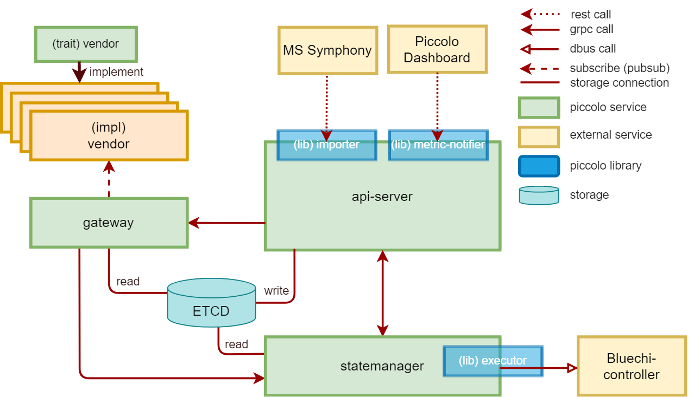

<!--
SPDX-License-Identifier: Apache-2.0
-->

# Pullpiri Project Structure



## Overview

Pullpiri is a Rust-based vehicle service orchestrator with a microservices architecture. The project is organized into four main layers:

```bash
.
├── containers/          # Docker/Podman container definitions
├── doc/                 # Documentation and images
├── examples/            # Example scenarios and configurations
├── LICENSES/            # License files
├── scripts/             # Build and CI/CD scripts
└── src/
    ├── agent/           # Remote node agent (runs on guest nodes)
    │   └── nodeagent/
    ├── common/          # Shared utilities and gRPC definitions
    ├── player/          # Execution plane (condition, state, action)
    │   ├── actioncontroller/
    │   ├── filtergateway/
    │   └── statemanager/
    ├── server/          # Management plane (artifact, storage, policy, config, log)
    │   ├── apiserver/
    │   ├── logservice/
    │   ├── monitoringserver/
    │   ├── policymanager/
    │   ├── rocksdbservice/
    │   └── settingsservice/
    └── tools/           # CLI tools and utilities
        ├── idl2rs/
        ├── pirictl/
        └── rocksdb-inspector/
```

---

## Component Details

### Agent Layer

#### NodeAgent (`src/agent/nodeagent/`)

**Purpose**: Runs on vehicle nodes to manage and orchestrate containerized workloads.

**Key Features**:
- Receives workload deployment instructions from the cloud/server
- Manages container lifecycle (creation, execution, removal)
- Reports node status and health to the server
- Executes scheduled tasks and policies
- Communicates via gRPC with server components

**Architecture**: 
- Standalone binary compiled for vehicle node deployment
- Cross-compiled to multiple architectures (x86_64, aarch64)
- Uses Podman as the container runtime

---

### Server Layer

The server layer provides central orchestration, storage, and management services. It runs on the same host node (e.g., HPC) as the player layer.

#### API Server (`src/server/apiserver/`)

**Purpose**: Main entry point for artifact deployment and orchestration.

**Key Features**:
- Exposes REST API on port 47099 for artifact deployment
- Parses YAML-formatted artifacts (Scenario, Package, Model, Volume, Network, Node, Policy, Schedule)
- Stores artifacts in RocksDB via gRPC service (port 47007)
- Forwards scenario updates to FilterGateway via gRPC
- Manages node registration and metadata
- Coordinates with PolicyManager for policy enforcement

**Key Interfaces**:
- REST API: `POST /api/artifact`, `DELETE /api/artifact`, `GET /api/notify`
- gRPC: Communicates with FilterGateway, PolicyManager, RocksDB service

#### RocksDB Service (`src/server/rocksdbservice/`)

**Purpose**: Persistent key-value storage for all Pullpiri artifacts and metadata.

**Key Features**:
- Provides gRPC interface on port 47007
- Stores all artifacts, scenarios, policies, and node information
- Replaces etcd for centralized storage
- Supports batch operations for efficiency
- Ensures data persistence across restarts

**Storage Keys**:
- `Scenario/{name}`: Scenario definitions
- `Package/{name}`: Package definitions
- `Policy/{name}`: Policy rules
- `nodes/{hostname}`: Node information
- `node/{node_id}`: Detailed node metadata

#### Settings Service (`src/server/settingsservice/`)

**Purpose**: Configuration management and versioning for Pullpiri settings.

**Key Features**:
- Exposes REST API on port 8080
- Manages `/etc/pullpiri/settings.yaml` configuration
- Provides configuration history and rollback capabilities
- Version control for configuration changes
- Query configuration by path

**Endpoints**:
- `GET /api/v1/settings/{path}`: Retrieve setting value
- `PUT /api/v1/settings/{path}`: Update setting value
- `GET /api/v1/history/{path}/version/{version}`: Get specific version
- `POST /api/v1/history/{path}/rollback/{version}`: Rollback to version

#### Policy Manager (`src/server/policymanager/`)

**Purpose**: Centralized policy management and enforcement.

**Key Features**:
- Manages security and resource policies
- Enforces policy rules on workload deployment
- Communicates with other components for policy validation
- Stores policies in RocksDB

#### Monitoring Server (`src/server/monitoringserver/`)

**Purpose**: Collects and aggregates metrics from deployed workloads.

**Key Features**:
- Receives metric reports from player components
- Aggregates performance and health data
- Exposes metrics endpoints for dashboards
- Tracks workload status and resource usage

#### Log Service (`src/server/logservice/`)

**Purpose**: Centralized logging for all Pullpiri components.

**Key Features**:
- Aggregates logs from all components
- Provides structured logging interface
- Enables log search and analysis
- Supports different log levels and filtering

---

### Player Layer

The player layer manages workload execution. It runs on the same host node as the server layer and consists of three coordinated components.

#### Action Controller (`src/player/actioncontroller/`)

**Purpose**: Executes deployment actions and manages workload lifecycle.

**Key Features**:
- Listens on port 47001 for gRPC commands from API Server
- Creates and manages containers via Podman
- Executes workload deployment, update, and removal actions
- Reports action execution status
- Handles reconciliation of desired vs actual state

#### Filter Gateway (`src/player/filtergateway/`)

**Purpose**: Monitors vehicle conditions and triggers scenario actions.

**Key Features**:
- Receives scenario conditions from API Server via gRPC
- Monitors vehicle bus messages and state changes
- Evaluates scenario conditions in real-time
- Forwards matching scenarios to State Manager
- Listens on port 47002 for gRPC communication
- Handles condition filtering and aggregation

#### State Manager (`src/player/statemanager/`)

**Purpose**: Orchestrates overall workload state and coordinates execution.

**Key Features**:
- Maintains current state of all deployed workloads
- Receives scenario triggers from Filter Gateway
- Coordinates with Action Controller for workload deployment
- Manages workload dependencies and ordering
- Reports state changes to Monitoring Server
- Ensures system consistency and reconciliation

**Data Flow**:
1. Filter Gateway detects condition match → sends to State Manager
2. State Manager determines required actions
3. State Manager requests Action Controller to execute
4. Action Controller deploys workloads via Podman
5. State Manager updates state and reports status

---

### Common Layer

#### Common (`src/common/`)

**Purpose**: Shared utilities, data types, and gRPC service definitions.

**Key Components**:
- **proto/**: gRPC protocol definitions
  - `apiserver.proto`: API Server communication
  - `filtergateway.proto`: Filter Gateway communication
  - `statemanager.proto`: State Manager communication
  - `nodeagent.proto`: Node Agent communication
  - `rocksdbservice.proto`: RocksDB service interface
  
- **spec/artifact/**: Kubernetes-like resource definitions
  - Scenario, Package, Model, Volume, Network, Node, Policy, Schedule
  
- **spec/k8s/**: Kubernetes Pod compatibility layer
  
- **Storage abstraction**:
  - RocksDB client for data persistence
  - KV operation support (put, get, delete, batch operations)

---

### Tools Layer

#### pirictl (`src/tools/pirictl/`)

**Purpose**: Command-line interface for Settings Service management.

**Features**:
- Query and update settings directly from CLI
- View configuration history
- Perform configuration rollback
- Useful for debugging and operations

#### rocksdb-inspector (`src/tools/rocksdb-inspector/`)

**Purpose**: Inspect and debug RocksDB storage.

**Features**:
- Browse RocksDB keys and values
- Export data for analysis
- Verify data integrity
- Useful for troubleshooting data issues

#### idl2rs (`src/tools/idl2rs/`)

**Purpose**: Convert DDS IDL files to Rust data structures.

**Features**:
- Parses DDS Interface Definition Language (IDL)
- Generates Rust struct definitions
- Enables vehicle bus message handling
- Supports common data types and nested structures

---

## Data Flow

### Artifact Deployment Flow

```
1. External System / Cloud
   ↓ (REST API - POST /api/artifact)
2. API Server (Port 47099)
   ↓ (parses YAML, stores in RocksDB)
3. RocksDB Service (Port 47007)
   ↓ (stores artifacts)
4. gRPC to Filter Gateway / Policy Manager
   ↓ (scenario and policy updates)
5. Player Components (Filter Gateway, State Manager, Action Controller)
```

### Scenario Execution Flow

```
1. Filter Gateway receives scenario
   ↓
2. Monitors vehicle conditions
   ↓
3. Condition satisfied → sends to State Manager
   ↓
4. State Manager evaluates and prepares actions
   ↓
5. Requests Action Controller to deploy
   ↓
6. Action Controller creates containers via Podman
   ↓
7. Reports completion to State Manager
   ↓
8. State Manager updates state and reports metrics
```

---

## Communication Protocols

### gRPC Services (default ports)

| Service | Port | Purpose |
|---------|------|---------|
| RocksDB | 47007 | Storage and metadata |
| API Server | Internal gRPC | Artifact coordination |
| Filter Gateway | 47002 | Condition monitoring |
| Action Controller | 47001 | Workload execution |
| State Manager | Internal gRPC | Orchestration |

### REST APIs

| Service | Port | Purpose |
|---------|------|---------|
| API Server | 47099 | Artifact deployment |
| Settings Service | 8080 | Configuration management |

---

## Storage Architecture

Pullpiri uses **RocksDB** as the primary persistent storage system. RocksDB provides:

- **Persistent storage** for all artifacts and metadata
- **Fast key-value operations** for efficient data access
- **Batch operations** for atomic multi-item updates
- **Scalability** for large-scale deployments
- **gRPC interface** for distributed access

Key-value examples:
- `Scenario/helloworld` → Scenario YAML definition
- `Package/helloworld` → Package YAML definition
- `Policy/resource-limit` → Policy definition
- `nodes/HPC` → Node IP address
- `node/HPC-192.168.1.100` → Detailed node metadata

---

## Build Artifacts

### Container Images

- `localhost/pullpiri:latest` - Main container with all server and player components
- `localhost/pullpiri-rocksdb:latest` - RocksDB service container

### Compiled Binaries

- NodeAgent binaries for multiple architectures (x86_64, aarch64)
- CLI tools (pirictl, rocksdb-inspector, idl2rs)

---

## Development Notes

- All components are implemented in **Rust** with async/await patterns
- Communication uses **gRPC** for efficiency and type safety
- Container management relies on **Podman** for lightweight containerization
- Configuration is stored in **YAML** for human readability


<!-- markdownlint-disable-file MD033 no-inline-html -->
width="75%"
height="75%"
/>

```bash
.
├── containers      # files for binary container
├── doc
│   ├── docs
│   └── images
├── examples
│   ├── nginx       # (optional) file server
│   └── resources   # package and scenario files
├── LICENSES
└── src
    ├── api         # gRPC proto files
    ├── apiserver
    ├── common      # common library
    ├── gateway
    ├── importer
    ├── statemanager
    └── vendor
        └── lge_dds # DDS receiver for gateway
```

## apiserver

Apiserver works similarly to apiserver in k8s.
It parses resources received via REST API through `importer` and writes actions and conditions to `etcd` so that the `gateway` can recognize the conditions.
In addition, it can access `statemanager` directly.

We are also developing to collect metrics for monitoring.

## importer

Importer is responsible for parsing resource files into the necessary items for Pullpiri.


<!-- markdownlint-disable-file MD033 no-inline-html -->