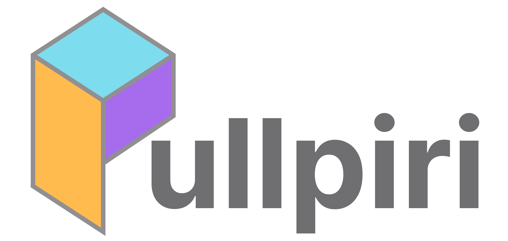

---
hide:
  - navigation
  - toc
---

{ .pullpiri-hero-logo width=300}

# __Container Orchestration Platform Optimized for Automotive Environments__

Pullpiri safely orchestrates various workloads in a way optimized for automotive environments.

[:material-rocket-launch: Get Started](guides/getting-started.md){ .md-button .md-button--primary } 
[:material-github: View on GitHub](https://github.com/eclipse-pullpiri/pullpiri){ .md-button }

  

## __What is Pullpiri?__

Pullpiri is an open-source orchestration platform optimized for in-vehicle environments.

Based on the Kubernetes orchestration model, it has been redesigned to account for the unique constraints of automotive systems, including limited resources, real-time requirements, and safety demands.

It enables consistent, container-based execution, management, and deployment of software within the vehicle.

 

## __Pullpiri's Features__

-   :material-tune-variant: __Condition-based Workload Control__

    ---

    Pullpiri applies predefined condition-based policies to control workload execution and switching automatically and dynamically.

-   :material-monitor-dashboard: __Resource-aware Workload Monitoring & Offloading__

    ---

    Pullpiri continuously monitors CPU, memory usage, and container states, and dynamically controls the execution, redeployment, and offloading of workloads according to system resource status.

-   :material-package-variant: __Unified Container Lifecycle Management__

    ---

    Pullpiri provides an integrated management framework for the entire container lifecycle—including deployment, execution, updates, and termination—enhancing the stability and operational efficiency of in-vehicle software.

-   :material-cube-outline: __Standardized Component Packaging__

    ---

    Pullpiri enables automotive software components to be packaged and executed in a standardized container format, strengthening architectural consistency, scalability, and modularity across the vehicle system.

-   :material-shield-check: __OEM Policy-driven Control__

    ---

    OEM operational policies and constraints can be directly reflected in orchestration policies. This includes software execution priorities, resource allocation rules, and allowable operating ranges specified by the OEM.

-   :material-layers-triple: __Mixed-Criticality Orchestration__

    ---

    Pullpiri runs criticality workloads (e.g., ADAS, control) alongside non-criticality services (e.g., infotainment) within one system, ensuring strict isolation and required safety/real-time priorities.

